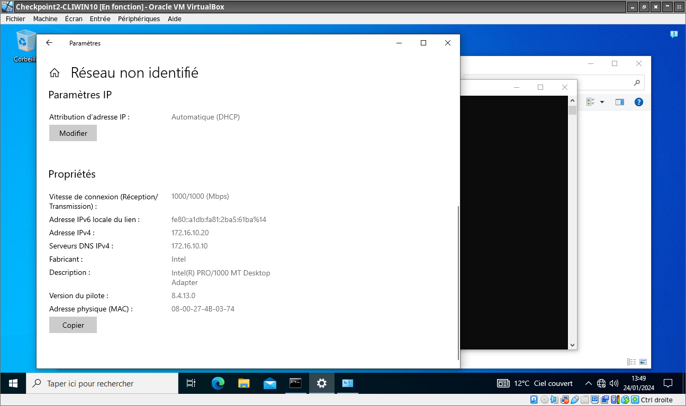

# Premier exercice

## Q.1.1 Pourquoi le ping avec les adresses IP des machines ne fonctionnent pas ?

Les deux machines ne sont pas sur le même LAN (les adresses IP sont différentes, elles ne sont pas dans le même /24).
Pour être méthodique, il faudrait vérifier la liaison physique (câbles) puis la liaison de donnée (ARP)
Ensuite on peut vérifier la nécessité et l'existence d'une passerelle. Les deux machines étant sur le même réseau 
physique, il convient de les configurer sur le même LAN, ainsi de changer l'adresse IP du client et peut-être le masque. 
Ce serait une mauvaise idée de changer les paramètres du serveur. On travaille donc sur la machine cliente. En pratique :
Démarrer > Paramètres > Réseau et Internet > Ethernet > Propriétés > Procole Intenet Version 4 (TCP/IP version 4) > Propriétés
et là on change l'adresse erronée par une acceptable. J'ai choisi 172.16.10.50 : je peux pinger le serveur depuis le client, et le client depuis le serveur (voir captures d'écran).
 

## Q.1.2. 
Le ping fonctionne avec les noms dans les deux sens, je n'ai fait aucune manip particulière pour ça, à part changer 
l'adresse IP du client qui était erronée (Q1.1), et renseigner le serveur DNS. J'ai aussi examiné la configuration DHCP et DNS 
du serveur.

(voir captures d'écran)

## Q.1.3 
J'ai activé le DHCP sur le client. Pas de remarque particulière à faire Aucune manipulation sur le serveur, sur le client 
clic paramètres> réseau et internet > (ethernet) > propriétés > (paramètres IP)> modifier (c'est une méthode différente de 
la précédente. Je me renseignerai là-desssus). Le client ne reçoit pas la première adresse du serveur. C'est parce qu'il y 
a une plage d'exclusion (voir capture).

## Q.1.4 Est-ce que ce client peut avoir l'adresse IP 172.16.10.15 en DHCP ?
Cette adresse est dans une zone d'exclusion, donc non a priori. Si on veut vraiment le faire, ce qui risque par exemple de 
priver un serveur de son adresse IP, si c'est la raison d'être de la zone d'exclusion, on peut procéder ainsi :
1. ôter l'adresse 172.16.10.15 de la zone d'exclusion ensuite il y a 2 méthodes :
* Première méthode : Dire au serveur DHCP d'attribuer l'adresse 172.16.10.15 à client1 (pour cela il faut renseigner 
l'adresse MAC de client1
* Deuxième méthode : faire de l'adresse 15 la première attribuable, client1 venant en premier, pas de problème, mais ça risque 
de ne plus marcher quand il y aura d'autres baux.
Dans un cas comme dans l'autre, il faut inclure l'adresse 15 au pool et exclure l'adresse 20 (afin que Clent1 ne la redemande)
Il y aurait une troisième méthode qui est celle utilisée en pratique d'attribuer au client une IP fixe. Elle ne répond pas à la 
question, donc je ne l'emploierai pas. Je choisis la deuxième méthode :
[IP client en 15](Client_en_15.png)

# Exercice 2

## Q.2.1 Lorsque l'on exécute le script il y a une erreur et le script AddLocalUsers.ps1 ne s’exécute pas.
Corrige ce script pour que le script AddLocalUsers.ps1 s'éxecute.
Il faut corriger le path de la commande appelée : il faut remplacer "Temp" par "Sript", ainsi main.ps1 lancera AddLocalUser.ps1

## Q.2.2 Le premier utilisateur du fichier Users.csv n'est jamais pris en compte. Modifie le script pour que cela soit le cas.

Quand on lit le CSV, il faut sauter une ligne (l'en-tête) au lieu de 2 : -skip 1 au lieu de -skip 2

## Q.2.3 Le champs Description est importé du fichier mais non-utilisé. 

Il faut ajouter à la déclaration de userInfo la ligne
User.Description = $Description ;

## Q.2.4 Dans l'importation des utilisateurs du fichier CSV, tous les champs sont pris.

(Non testé) dans l'initialisation de $users ne garder que les champs qui sont utilisé 

## Q.2.5 Le mot de passe crée n'est pas affiché, donc on ne le connait pas. Affiche le avec le message indiquant qu'un compte est crée.

Dans la boucle de création, quand celle-ci est effective, il faut rajouter ceci :
Write-Host "l'utilisateur $Name est créé , son mot de passe est $Pass" (en effet $password contient le mot de passe hashé)

## Q.2.6 Une fonction de création de log, nommée Log existe.

Le fichier de log est défini, mais pas utilisé,
Ajouter cette ligne dans la boucle principale :

Log -FilePath $LogFile -Content "Utilisateur $Name créé , Password: $Password"

## Q.2.7 Si l'utilisateur à créer existe déjà, il n'est pas crée.

Il convient de rajouter un else au if qui vérifie que l'utilisateur n'existe pas avant de le créer

quelque chose comme else 	{
        write-host "l'utilisateur $name existe déjà et ne sera pas scréé de nouveau"
				}

## Q.2.8 L'ajout des utilisateurs dans le groupe des utilisateurs locaux ne fonctionne pas.

L'emploi de la commande Add-LocalGroupMember ne convient pas, il faut utiliser Add-UserToLocalGroup à la place

## Q.2.9 Plusieurs fois dans le code du script, la chaine "$Prenom.$Nom" est utilisée.
La variable $name est déjà initiée dans le script à $prenom.$nom il suffit de remplacer les occurences suivante par $name et tout rentre dans l'ordre.

## Q.2.10 Les comptes utilisateurs créer ont un mot de passe qui expire.

Dans $UserInfo il faut changer la valeur de PasswordNeverExpires de false à true.

## Q.2.11 Modifie le code pour que le mot de passe soit constitué de 10 caractères au lieu de 6.
Il faut remplacer $length = 6 par $length = 10

# Troisième exercice

## Q.3.1 Quel est le matériel réseau A ?
Si on se fie à son symbole et à sa position dans le réseau, il s'agit d'un switch qui lie les différents nœuds du réseau

## Q.3.2  Quel est le matériel réseau B

D'après son symbole et sa position dans le réseau, il s'agit d'un routeur il sert de passerelle entre les réseaux 10.10.0.0/16 et 10.12.2.0/24

## Q.3.3 Que signifie f0/0 et g1/0 sur l’élément B ?
Il s'agit des interfaces du routeur: f0/0 signifie qu'il s'agit de la première (on compte depuis zéro) interface en fast (le f) ethernet, g1/0 signifie qu'il s'agit de la 2ème interface en gigabit celle-ci (le g). Pour optimiser la connexion le g1/0 est relée à un autre routeur et le f0/0 à un switch (et lui même à des équipements terminaux)

## Q.3.4 Pour l'ordinateur PC2, que représente /16 dans son adresse IP ?
/16 représente le réseau, sa taille etc. en fait la taille est 2^16 soit 65536, soit effectivment la possibilité d'adresser 65534 adesse (on ôte l'adresse du réseau et son adresse de diffusion.

## Q.3.5 Pour ce même ordinateur, que représente l'adresse 10.10.255.254 ?
Il s'agit de l'adresse de sa passerelle par défaut

## Q.3.6 Pour les ordinateur PC1, PC2, et PC5 donne :

   | machine | L'adresse de réseau | La première adresse disponible | La dernière adresse disponible | L'adresse de diffusion |
   | :-----: | :-----------------: | :----------------------------: | :----------------------------: | :--------------------: |   
   | PC1     | 10.10.0.0/16        | 10.10.0.1                      | 10.10.255.254                  | 10.10.255.255          |
   | PC2     | 10.11.0.0/16        | 10.11.0.1                      | 10.11.255.254                  | 10.11.255.255          |
   | PC5     | 10.10.4.0/15        | 10.10.4.0.1                    | 10.10.255.126                  | 10.10.255.127          |
Le réseau de PC5 est inclus dans celui de PC1, il y aura un problème si PC5 envoie un message de diffusion, il ne pourra donc pas découvrir les autres

## Q.3.7
les PC 1,3 et 4 pourront communiquer ensemble. Pour le 5 j'ai un doute et je n'ai pas suffisamment de connaissance pour statuer Cf précédente question.

## Q.3.8
Les mêmes qu'à la question précédente pourront communiquer avec le réseau 172.x.x.x étant donné qu'ils ont la bonne passerelle

## Q.3.9 Quel incidence y-a-t'il pour les ordinateurs PC2 et PC3 si on intervertit leur ports de connexion sur le matériel A ?
Il ne se passera rien de spécial, les switchs sont agnostiques

## Q.3.10 On souhaite mettre la configuration IP des ordinateurs en dynamique. Quelles sont les modifications possible ?
La mise en œuvre de serveurs DHCP avec des plages cohérentes permettra de faire que toutes les machines puissent communiquer entre elles. Il faut mettre en place un serveur DHCP et le configurer en fonction de la topologie souhaitée pour le(s) réseau(x)

## Q.3.11 
C'est 10.10.4.1 qui initie,c'est donc PC1

## Q.3.12 Est-ce que la communication enregistrée dans cette capture a réussi ?
La communication a réussi, il s'agit d'un ping (ICMP echo) entre PC1 et PC4, aucune trame n'est perdue, la communication s'est bien déroulée.

## Q.3.13 Dans cette capture, à quel matériel correspond le request et le reply 
Le ***request*** est le fait de PC1 (IP 10.10.4.1/16, MAC 00:50:79:66:68:00)
le ***reply*** est le fait de PC4 (IP 10.10.4.2/16, MAC 00:50:79:66:68:03)

## Q.3.14 Dans le paquet N°2, quel est le protocole encapsulé ?
Je ne me souviens plus, mais il s'agit d'une annonce. Cela permet à PC4 de se faire connaitre de PC1

## Q.3.15 Quels ont été les rôles des matériels A et B dans cette communication ?
A transmet les requêtes de PC1 vers PC4 et les réponse de PC4 à PC1 sans les altérer. B ne joue aucun rôle dans cet échange, juste le routeur B ne répond pas à la sollicitation.

## Q.3.16 Dans cette trame, qui initialise la communication ? 
C'est 10.10.80.3 qui initie. Son adresse MAC n'est pas citée dans l'énoncé mais 00:50:79:66:68:02 qui ne désigne aucune interface citée dans l'énoncé . L'équipement et sur le réseau IP de PC1, PC3 et PC4.

## Q.3.17 Quel est le protocole encapsulé ? Quel est son rôle ?
Le protocole encapsulé est ICMP echo. Il; sert à vérifier si une machine est sur le réseau, ateignable et si elle est en vie. Ceci dit, si une machine ne répond pas cela ne signifie pas nécessairement qu'elle est éteinte ou hors ligne.Par contre la réponse reçu est caractérisique d'un problème réseau.

## Q.3.18 Est-ce que cette communication a réussi ?
La communication a échoué. Le récipient n'a pas une bonne configuration réseau. Il s'agit de 10.11.80.2 soit PC2 dont l'adresse IP est hors de l'intervale

## Q.3.19 Explique la ligne du paquet N° 2
Il s'agit de la réponse de la passerelle au ping, pour indiquer que l'IP est inateignable.

## Q.3.20 Quels ont été les rôles des matériels A et B ?
A a transmis les trames ethernet de façon agnostique, B a examiné l'adresse de destination pour décréter que l'hôte était inateignable.

## Q.3.21 Dans cette trame, donne les noms et les adresses IP des matériels sources et destination.
- Source : 10.10.4.2 soit PC4
- Destination 172.16.5.253 soit une machine du réseau  172.16.5.0/24

## Q.3.22 Quelles sont les adresses mac source et destination ? Qu'en déduis-tu ?
Les matériels réseau proviennent du même fabricant. Les numéros de série ne se suivent pas. Comme il s'agit d'une communication inter-réseaux, on peut supposer qu'il s'agit des @MAC des passerelles.

## Q.3.23 A quel emplacement du réseau a été enregistré cette communication ? 
La communication a été enregistrée en B ou entre B et R2

